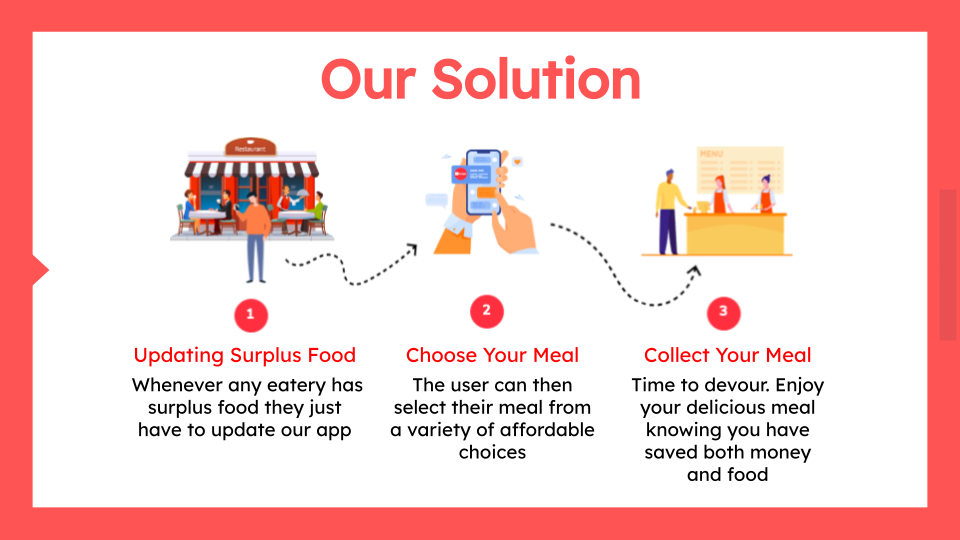
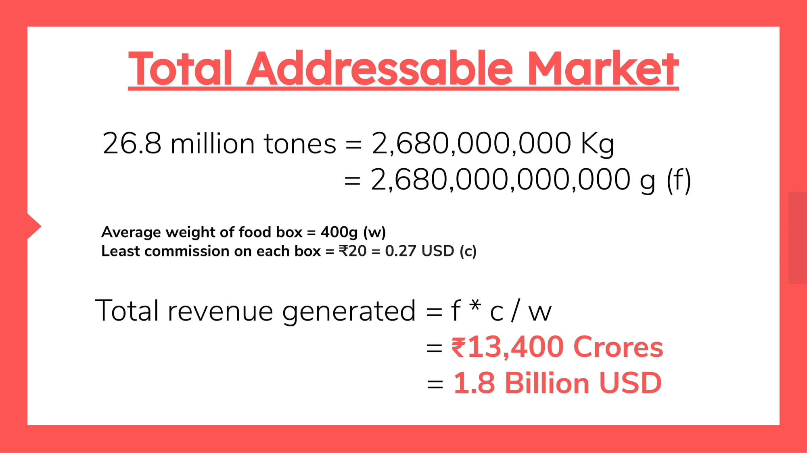
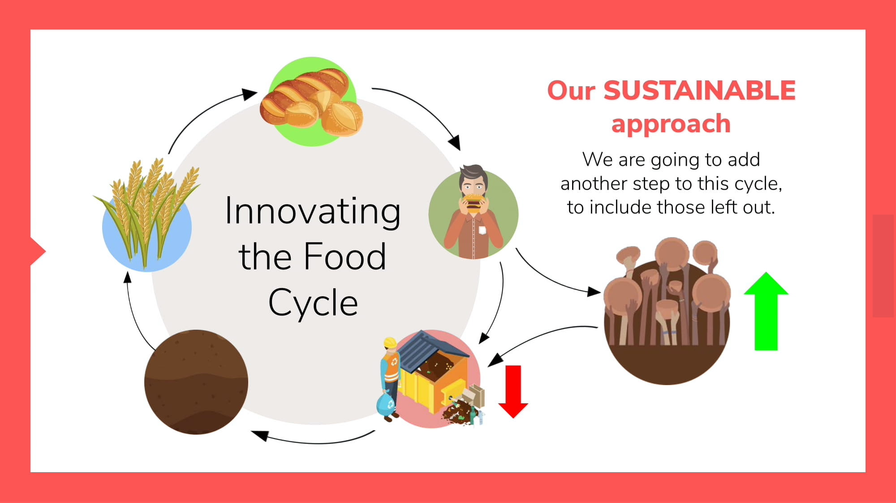
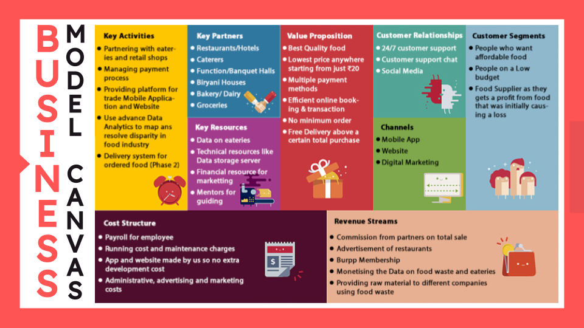
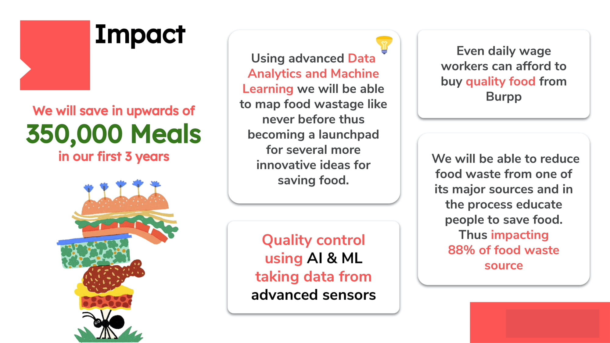
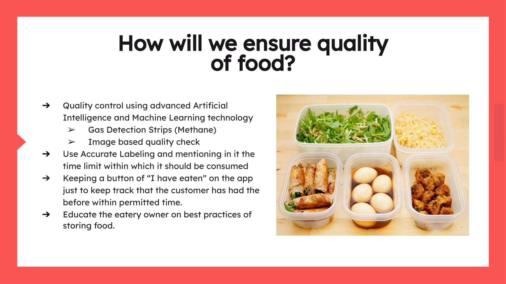
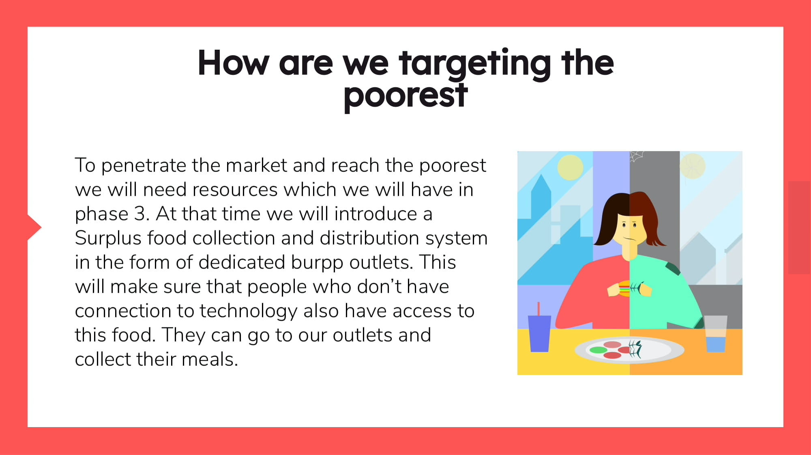
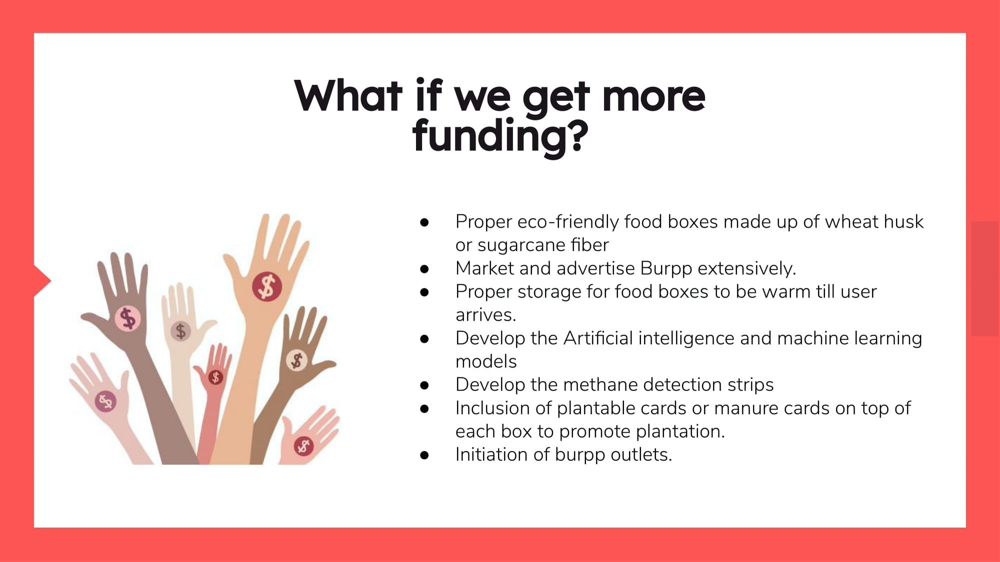

# Project Burpp

  

## Contents

- [Project Burpp Summary](#project-burpp-summary)
  - [What's the problem?](#whats-the-problem)
  - [How can technology help?](#how-can-technology-help)
  - [The idea](#the-idea)
- [Demo video](#demo-video)
- [The architecture](#the-architecture)
- [IBM Products](#ibm-products)
- [Total Addressable Market](#total-addressable-market)
- [Sustainable Approach](#sustainable-approach)
- [Business Model](#business-model)
- [Project roadmap](#project-roadmap)
- [Impact](#impact)
- [Work Done So Far](#work-done-so-far)
- [FAQ](#faq)
- [React App Website](#react-app-website)
- [React Native Mobile Application (Android + IOS)](#react-native-mobile-application)

## Project Burpp Summary

### What's the problem?

You must have visited a wedding ceremony or any function or party and enjoyed the food there. But have you ever thought what happens to the surplus food? It goes to waste. This is wrong as the food was fresh and good to eat. The only problem being that there was no one there to consume it. Over 190,000,000 people in india sleep on an empty stomach yet such wastage of food takes place at mass scale. This problem transcends wedding ceremonies and parties and is spread across all of the catering industry. 

### How can technology help?

With the help of technology we want to bridge this gap between the supply and demad of this food. At present surplus food is wasted at every type of catering business. We can properly monitor the data and come up with innovative solutions to tackle this greave situation. 

### The idea

It is imperative that we connect these eateries to the people who need affordable good qualiy food. We created and online store having a Android application, an IOS application and a Web application where eateries can update their surplus food. Users can then scroll though the available food and book their affordable meal. This will not only ensure that the surplus food is not wasted but also help those millions of hungry people with proper meals. 

The primary goal of Burpp is to fight the growing issue of food waste. To do so, it provides a solution for food service providers to sell their surplus food which otherwise would have been wasted during business hours. However, the app is just one way to fight food waste, as it also directly encourages households, schools and general public to change their behaviour and aims to influence people that will reduce food waste further.

## Demo Video

https://drive.google.com/file/d/1TG-79s-rIGqnf_5ZUEazys67OF1X08FJ/view?usp=sharing

## The Architecture

## IBM Products

* **IBM Watson** - for analysing data received from customer. This will help us understand the food production, consumption & wastage better and thus help us in improving our product to save more food.
* **IBM API Connect** - to create api key for interaction from user side to give an appropriate response from server.
* **IBM Cloudant DataBase** - to gives us more easy way to store data in sematic order and it can easily handle any kind of modification required. Better way to work with.
* **IBM Server** - for storing all our data for further use
* **IBM Cloud Hosting** - for hosting our website and APIs

## Total Addressable Market

## Sustainable Approach

## Business Model

## Project Roadmap

## Impact

## Work Done So Far

## FAQ

## React App Website

# Getting Started with Create React App

This project was bootstrapped with [Create React App](https://github.com/facebook/create-react-app).

## Available Scripts

In the project directory, you can run:

### `npm start`

Runs the app in the development mode.\
Open [http://localhost:3000](http://localhost:3000) to view it in your browser.

The page will reload when you make changes.\
You may also see any lint errors in the console.

### `npm test`

Launches the test runner in the interactive watch mode.\
See the section about [running tests](https://facebook.github.io/create-react-app/docs/running-tests) for more information.

### `npm run build`

Builds the app for production to the `build` folder.\
It correctly bundles React in production mode and optimizes the build for the best performance.

The build is minified and the filenames include the hashes.\
Your app is ready to be deployed!

See the section about [deployment](https://facebook.github.io/create-react-app/docs/deployment) for more information.

### `npm run eject`

**Note: this is a one-way operation. Once you `eject`, you can't go back!**

If you aren't satisfied with the build tool and configuration choices, you can `eject` at any time. This command will remove the single build dependency from your project.

Instead, it will copy all the configuration files and the transitive dependencies (webpack, Babel, ESLint, etc) right into your project so you have full control over them. All of the commands except `eject` will still work, but they will point to the copied scripts so you can tweak them. At this point you're on your own.

You don't have to ever use `eject`. The curated feature set is suitable for small and middle deployments, and you shouldn't feel obligated to use this feature. However we understand that this tool wouldn't be useful if you couldn't customize it when you are ready for it.

## Learn More

You can learn more in the [Create React App documentation](https://facebook.github.io/create-react-app/docs/getting-started).

To learn React, check out the [React documentation](https://reactjs.org/).

### Code Splitting

This section has moved here: [https://facebook.github.io/create-react-app/docs/code-splitting](https://facebook.github.io/create-react-app/docs/code-splitting)

### Analyzing the Bundle Size

This section has moved here: [https://facebook.github.io/create-react-app/docs/analyzing-the-bundle-size](https://facebook.github.io/create-react-app/docs/analyzing-the-bundle-size)

### Making a Progressive Web App

This section has moved here: [https://facebook.github.io/create-react-app/docs/making-a-progressive-web-app](https://facebook.github.io/create-react-app/docs/making-a-progressive-web-app)

### Advanced Configuration

This section has moved here: [https://facebook.github.io/create-react-app/docs/advanced-configuration](https://facebook.github.io/create-react-app/docs/advanced-configuration)

### Deployment

This section has moved here: [https://facebook.github.io/create-react-app/docs/deployment](https://facebook.github.io/create-react-app/docs/deployment)

### `npm run build` fails to minify

This section has moved here: [https://facebook.github.io/create-react-app/docs/troubleshooting#npm-run-build-fails-to-minify](https://facebook.github.io/create-react-app/docs/troubleshooting#npm-run-build-fails-to-minify)

## React Native Mobile Application

<h1 align="center">
  <a href="https://reactnative.dev/">
    React Native
  </a>
</h1>

  <strong>Learn once, write anywhere:</strong> 
  Build mobile apps with React.

  
  
  
  
  

<h3 align="center">
  <a href="https://reactnative.dev/docs/getting-started">Getting Started</a>
   · 
  <a href="https://reactnative.dev/docs/tutorial">Learn the Basics</a>
   · 
  <a href="https://reactnative.dev/showcase.html">Showcase</a>
   · 
  <a href="https://reactnative.dev/docs/contributing">Contribute</a>
   · 
  <a href="https://reactnative.dev/help">Community</a>
   · 
  <a href="https://github.com/facebook/react-native/blob/master/.github/SUPPORT.md">Support</a>
</h3>

React Native brings [**React**'s][r] declarative UI framework to iOS and Android. With React Native, you use native UI controls and have full access to the native platform.

- **Declarative.** React makes it painless to create interactive UIs. Declarative views make your code more predictable and easier to debug.
- **Component-Based.** Build encapsulated components that manage their state, then compose them to make complex UIs.
- **Developer Velocity.** See local changes in seconds. Changes to JavaScript code can be live reloaded without rebuilding the native app.
- **Portability.** Reuse code across iOS, Android, and [other platforms][p].

React Native is developed and supported by many companies and individual core contributors. Find out more in our [ecosystem overview][e].

[r]: https://reactjs.org/
[p]: https://reactnative.dev/docs/out-of-tree-platforms
[e]: https://github.com/facebook/react-native/blob/master/ECOSYSTEM.md

## Contents

- [Requirements](#-requirements)
- [Building your first React Native app](#-building-your-first-react-native-app)
- [Documentation](#-documentation)
- [Upgrading](#-upgrading)
- [How to Contribute](#-how-to-contribute)
- [Code of Conduct](#code-of-conduct)
- [License](#-license)

## 📋 Requirements

React Native apps may target iOS 11.0 and Android 5.0 (API 21) or newer. You may use Windows, macOS, or Linux as your development operating system, though building and running iOS apps is limited to macOS. Tools like [Expo](https://expo.io) can be used to work around this.

## 🎉 Building your first React Native app

Follow the [Getting Started guide](https://reactnative.dev/docs/getting-started). The recommended way to install React Native depends on your project. Here you can find short guides for the most common scenarios:

- [Trying out React Native][hello-world]
- [Creating a New Application][new-app]
- [Adding React Native to an Existing Application][existing]

[hello-world]: https://snack.expo.io/@hramos/hello,-world!
[new-app]: https://reactnative.dev/docs/getting-started
[existing]: https://reactnative.dev/docs/integration-with-existing-apps

## 📖 Documentation

The full documentation for React Native can be found on our [website][docs].

The React Native documentation discusses components, APIs, and topics that are specific to React Native. For further documentation on the React API that is shared between React Native and React DOM, refer to the [React documentation][r-docs].

The source for the React Native documentation and website is hosted on a separate repo, [**@facebook/react-native-website**][repo-website].

[docs]: https://reactnative.dev/docs/getting-started
[r-docs]: https://reactjs.org/docs/getting-started.html
[repo-website]: https://github.com/facebook/react-native-website

## 🚀 Upgrading

Upgrading to new versions of React Native may give you access to more APIs, views, developer tools, and other goodies. See the [Upgrading Guide][u] for instructions.

React Native releases are discussed in the React Native Community, [**@react-native-community/react-native-releases**][repo-releases].

[u]: https://reactnative.dev/docs/upgrading
[repo-releases]: https://github.com/react-native-community/react-native-releases

## 👏 How to Contribute

The main purpose of this repository is to continue evolving React Native core. We want to make contributing to this project as easy and transparent as possible, and we are grateful to the community for contributing bug fixes and improvements. Read below to learn how you can take part in improving React Native.

### [Code of Conduct][code]

Facebook has adopted a Code of Conduct that we expect project participants to adhere to.
Please read the [full text][code] so that you can understand what actions will and will not be tolerated.

[code]: https://code.fb.com/codeofconduct/

### [Contributing Guide][contribute]

Read our [**Contributing Guide**][contribute] to learn about our development process, how to propose bugfixes and improvements, and how to build and test your changes to React Native.

[contribute]: https://reactnative.dev/docs/contributing

### [Open Source Roadmap][roadmap]

You can learn more about our vision for React Native in the [**Roadmap**][roadmap].

[roadmap]: https://github.com/facebook/react-native/wiki/Roadmap

### Good First Issues

We have a list of [good first issues][gfi] that contain bugs which have a relatively limited scope. This is a great place to get started, gain experience, and get familiar with our contribution process.

[gfi]: https://github.com/facebook/react-native/labels/good%20first%20issue

### Discussions

Larger discussions and proposals are discussed in [**@react-native-community/discussions-and-proposals**][repo-meta].

[repo-meta]: https://github.com/react-native-community/discussions-and-proposals

## 📄 License

React Native is MIT licensed, as found in the [LICENSE][l] file.

React Native documentation is Creative Commons licensed, as found in the [LICENSE-docs][ld] file.

[l]: https://github.com/facebook/react-native/blob/master/LICENSE
[ld]: https://github.com/facebook/react-native/blob/master/LICENSE-docs
